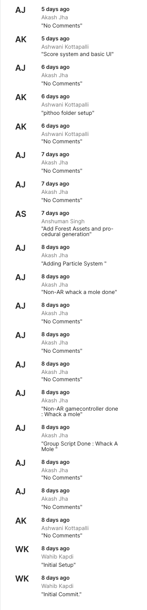
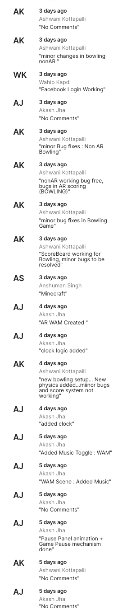
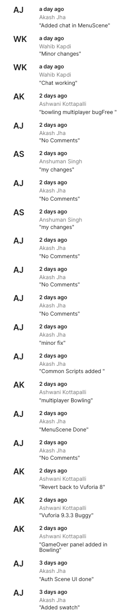
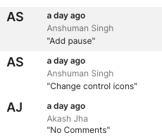
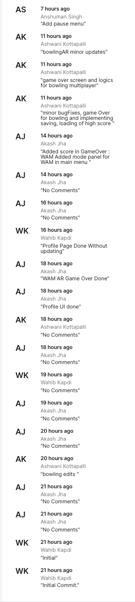
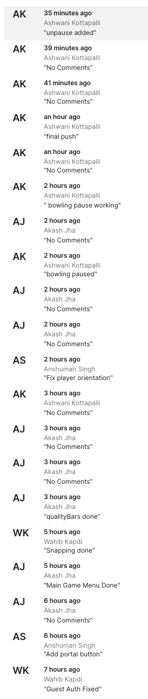

# Chimera
<b>Chimera</b> is a social hybrid gaming platform, developed by team <b>Vikings.</b> It has one long term game to retain out base users along with multiple hyper casual games to bring in new users.The hyper casual games come in various modes namely Single Player, Pass and Play  and 3D Augmented Reality compatible. The platform is also supplemented with a social hub for gamers to interact with fellow gamers, to ask for help and resources for progress in the game or casually hang out.
Our app also brings opportunities to Indian developers to host and monetize their games on our platform. They will enjoy the benefits of our existing customer base to build an initial user base for their game. 

## Tech used:
<ul>
  <li>UNITY 3D - A game development engine, CHIMERA is made on Unity 3D engine
<li>Vuforia SDK - A development kit for making Augmented Reality applications/games 
<li>Firebase SDK - For adding highly secured login/registration system
<li>Blender - To create 3D assets for some games
<li>Bosca Ceoil - To create our own custom game music
<li>Photoshop - To plan and create UI for the game
<li>Illustrator - For creating 2D art and mascot for the platform
<li>C# - Programming Language used for making games on Unity 3D
</ul>

## Team Members
<ul>
  <li>Akash Jha</li>
  <li>Ashwani Kotapalli</li>
  <li>Anshuman Singh</li>
  <li>Abhijeet Swain</li>
  <li>Wahib Sabir Kapdi</li>
</ul>

## Screenshots
- Unity Collab commit history(As of 5:30PM, 18th August) 
  
  
  
  
  
  
